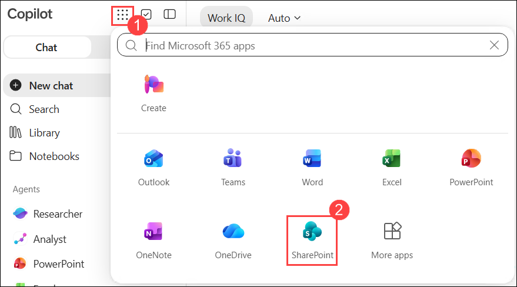
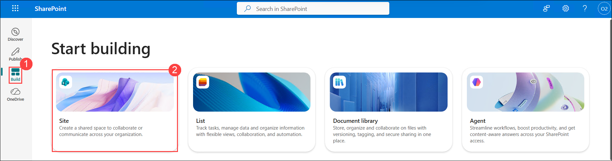
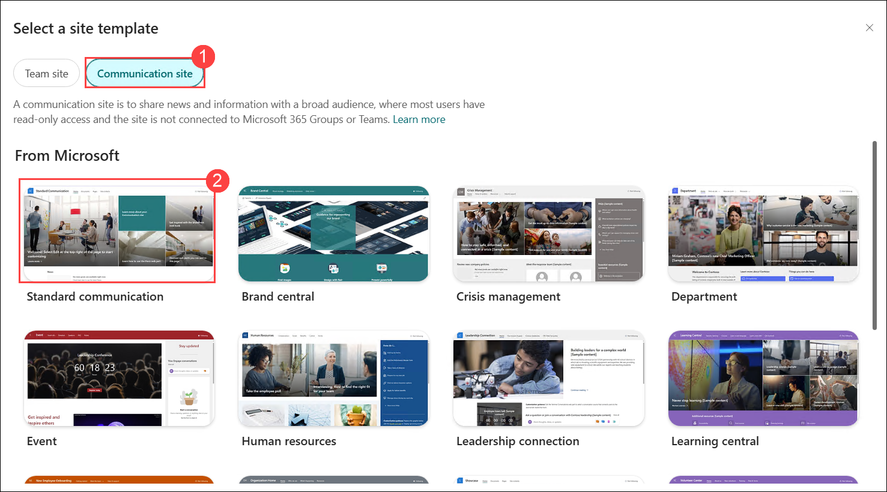
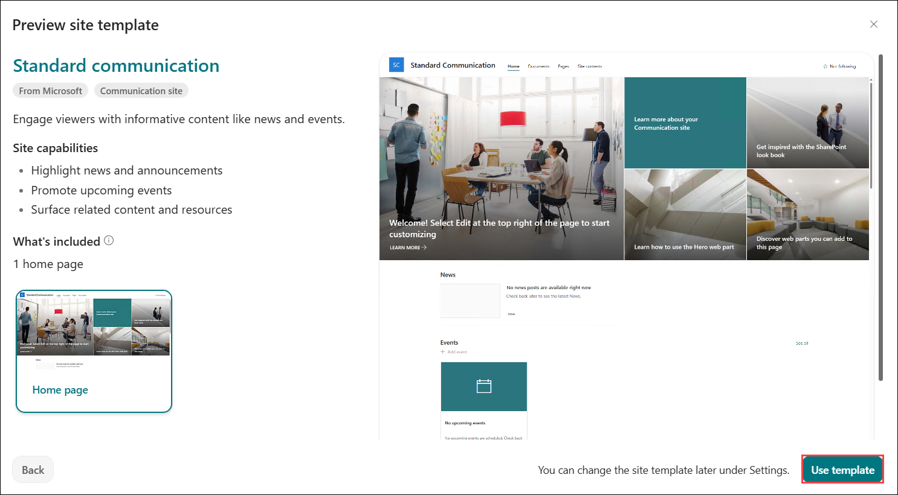
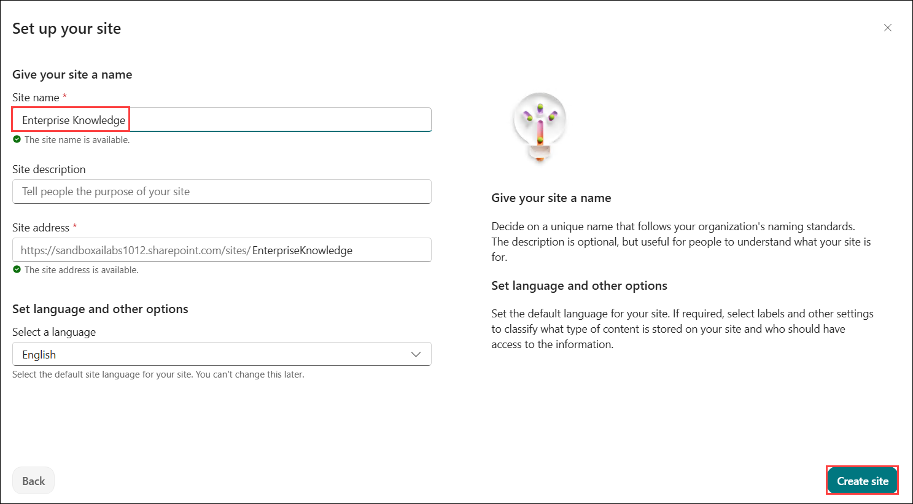
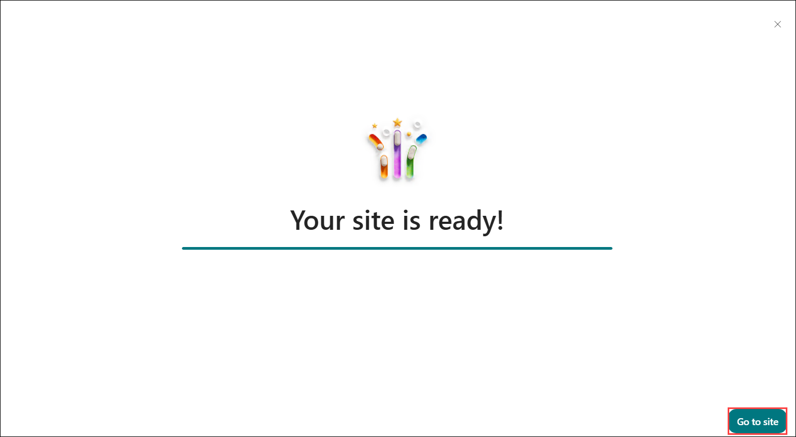
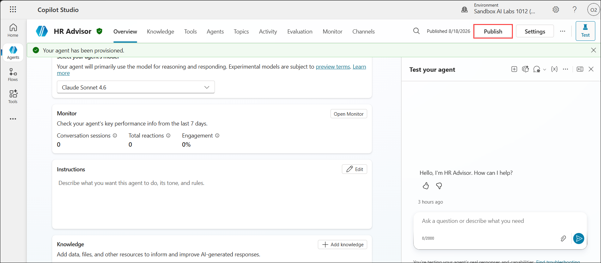
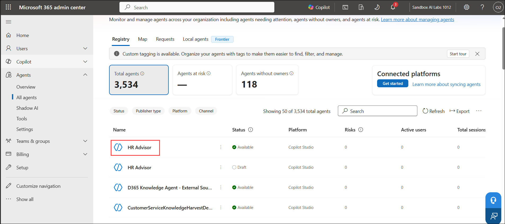
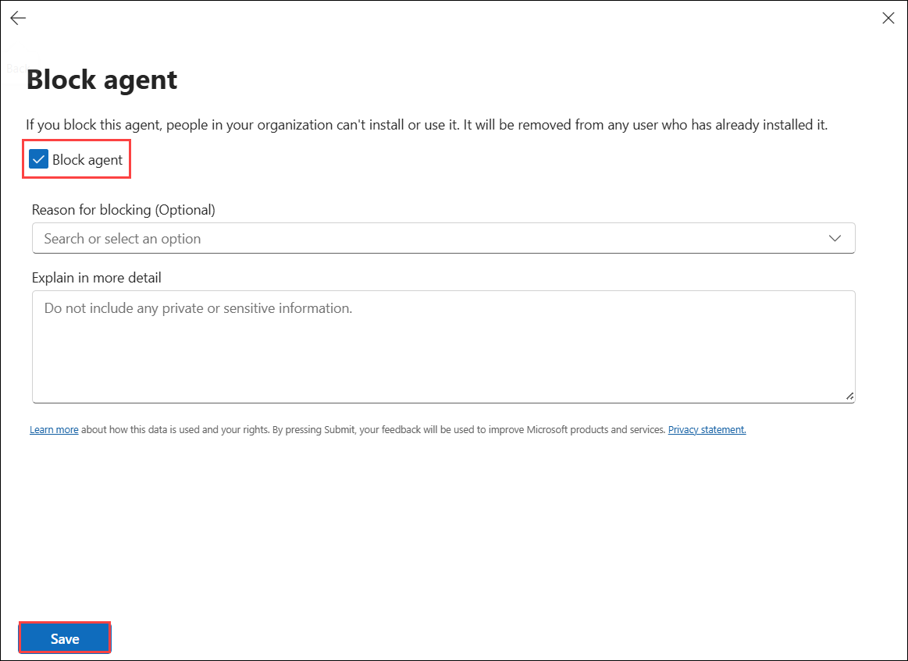
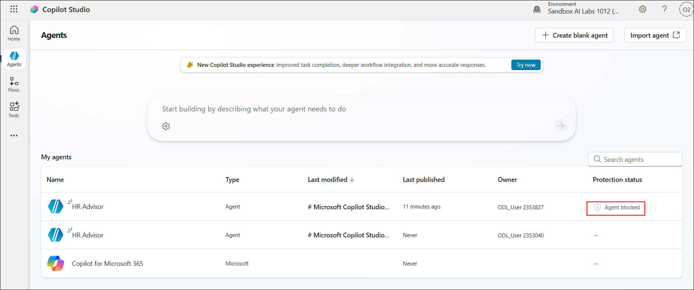

# Lab 6- Extend Microsoft 365 Copilot Chat with a HR agent built using Copilot Studio

## Lab scenario

Zava Ltd. is a global professional services and technology solutions
company with a distributed workforce. The organization uses Microsoft
365, SharePoint, and Power Platform to manage HR operations, employee
learning, and recruitment data.

Zava is looking to enhance employee experience by enabling quick,
conversational access to HR-related information directly within
Microsoft 365 Copilot Chat. Employees frequently ask questions about HR
policies, career growth opportunities, learning pathways, and
recruitment data stored across SharePoint sites.

To address this, Zava\'s IT and HR teams decide to build a dedicated HR
agent using Microsoft Copilot Studio. This agent will be declaratively
defined, hosted inside Microsoft 365 Copilot Chat, and enriched with
organizational knowledge stored in SharePoint. The solution must be
built in a secure, isolated Power Platform environment and seamlessly
integrated into the Microsoft 365 experience.

## Lab Objective

By completing this lab, you will learn how to:

- Create and manage a dedicated Power Platform environment for agent
  development.

- Build a declarative agent using Microsoft Copilot Studio for Microsoft
  365 Copilot Chat.

- Define agent purpose, tone, and behavioral goals using natural
  language prompts.

- Choose the reasoning model that powers the agent, including newly
  available model options.

- Publish and deploy the agent into Microsoft 365 Copilot Chat.

- Create and configure a SharePoint communication site to host
  HR-related data.

- Add SharePoint-based knowledge sources to a Copilot Studio agent.

- Test the agent\'s ability to retrieve and reason over structured
  organizational data within Copilot Chat.

Govern the published agent from the Microsoft 365 admin center ---
review its data & tool access, reassign ownership, and block it if
needed.

## Exercise 1: Create SharePoint site

In this exercise, you will create a SharePoint site and upload the
sample documents there which will be used later in this lab.

1.  From a new browser, navigate to <https://m365.cloud.microsoft/chat/>
    and login with your lab credentials.
    

2.  Enter Temporary Access Pass.

    

3.  Select Yes (or No) on the "Stay signed in?" prompt. This same
    sign-in sequence appears every time you\'re asked to log in later in
    this lab.

    

4.  Select the **App launcher** icon from the top-left corner, and then select **SharePoint**.

    

5. In SharePoint, select **Build** from the left navigation, and then select **Site**.

    

1. Under **Select a site template**, select **Communication site**. Select the **Standard communication** template.

    

1. Review the **Standard communication** template and select **Use template**.

    

1. In the **Site name** field, enter **Enterprise Knowledge**. Verify that the site address is available, keep the language as **English**, and select **Create site**.

    

1. Wait for the site creation to complete. When **Your site is ready!** appears, select **Go to site**.

    

11. Once created, note down the URL of this site.

    

12. Select Documents from the menu bar. Select + Create or upload →
    Files upload. Upload the following documents:

    

## Exercise 2: Creating an agent for Microsoft 365 Copilot Chat

In this exercise you are going to create a declarative agent with
Microsoft Copilot Studio and host it in Microsoft 365 Copilot Chat.

1.  Login to <https://copilotstudio.microsoft.com> using the login
    credentials.

2.  Select +Create blank agent.

    

3.  Enter the agent name and select Create.

    - Name - HR Advisor

       

4.  Paste the description as follows:
    
    ```
    HR Advisor is an AI-powered employee support assistant that helps
    employees quickly find answers to HR-related questions using
    information from the organizations Employee Handbook.
    ```

    

\[!Alert\] This exercise now provisions the agent shell first and layers
on description, instructions, and model choice afterward --- if you
don\'t see fields for Description/Instruction during creation, that\'s
expected; add them on the Overview tab as described above.

## Exercise 3: Adding knowledge to the agent

1.  Scroll down to the Knowledge section.

    

2.  In the SharePoint link placeholder, paste the link copied in
    Exercise 1:\
    

    

3.  Preview the Knowledge source attached:

    

1. In **Copilot Studio**, open the **HR Advisor** agent and select **Publish**.

     

## Exercise 4: Governing the agent in the Microsoft 365 admin center

1.  Sign in to <https://admin.microsoft.com> with the same lab
    credentials (username, then Temporary Access Pass; select Yes if
    prompted to stay signed in).

1. In the **Microsoft 365 admin center**, navigate to **Agents > All agents**, and select **HR Advisor**.

    

3. In the **Block agent** window, select **Block agent**, optionally provide a reason and details, and then select **Save**.

    

4. Return to **Copilot Studio** and verify that the **HR Advisor** agent displays **Agent blocked** under **Protection status**.

    

## Summary

In this lab, you successfully extended Microsoft 365 Copilot Chat by
creating an Agentic HR declarative agent using Microsoft Copilot Studio.
You set up a dedicated Power Platform environment, named and provisioned
an HR-focused agent, and then layered on its description, instructions,
and reasoning model --- including newly available model choices such as
Claude Sonnet 4.6 --- before publishing and integrating it into the
Microsoft 365 Copilot experience.

You also created a SharePoint communication site, uploaded HR-related
content, and connected it as a knowledge source for the agent through
the updated SharePoint knowledge dialog. You validated the solution by
querying the agent in Copilot Chat and receiving context-aware responses
sourced from SharePoint.

Finally, you reviewed how administrators govern published agents from
the Microsoft 365 admin center\'s agent registry --- inspecting data and
tool access, reassigning ownership, and blocking an agent when
necessary.

This lab demonstrates how Copilot Studio enables organizations to build
domain-specific agents that securely leverage enterprise knowledge, and
how IT admins retain oversight and control once those agents are in
employees\' hands.
