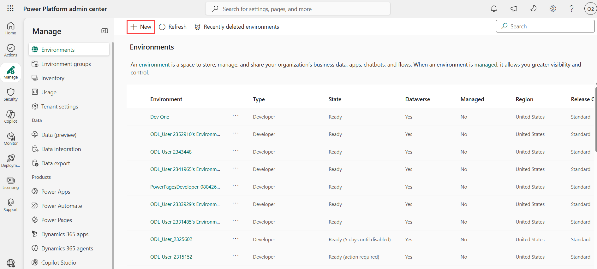
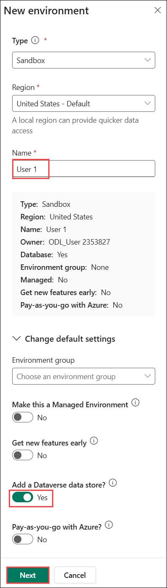
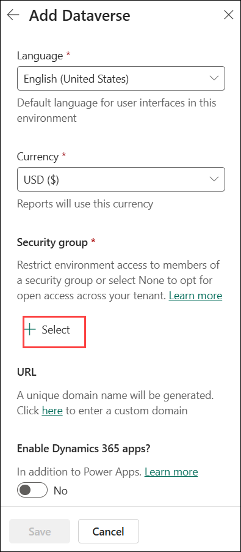
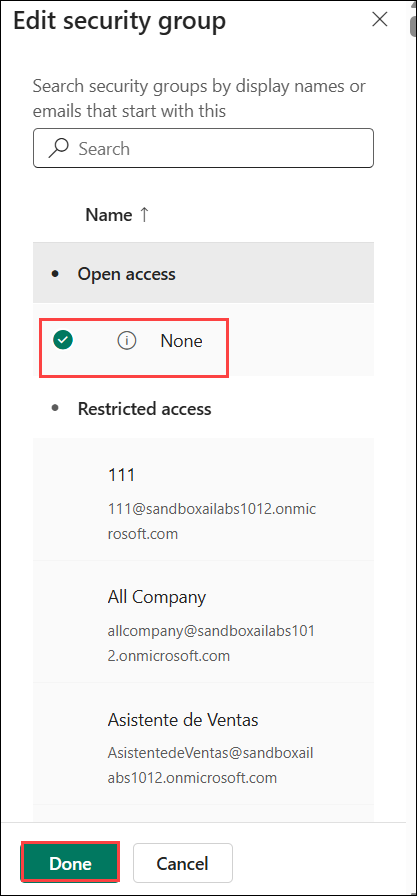
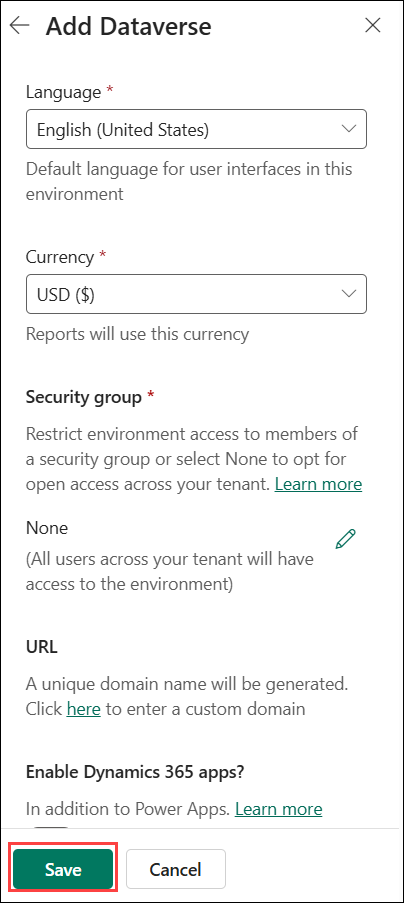

# Lab 7- Build an autonomous financial data retrieval agent with Computer-Using Agents (CUA)

**Introduction**

Legacy systems without APIs create major roadblocks for automation.
Traditional RPA often relies on fragile screen-scraping or manual
workarounds, which slow down decision-making, increase errors, and
reduce productivity. This lab introduces Microsoft Copilot Studio and
Computer Using Agents (CUA) as a smarter solution. By simulating human
interaction with internal systems, CUAs can securely access and process
data - without needing API integration. You'll learn to build an
autonomous agent that delivers faster responses, reduces manual
workload, and enables real-time, informed decisions.

Objective

In this lab, you'll learn how to build an autonomous agent using
Microsoft Copilot Studio. This agent will simulate human interaction
with a legacy internal system to retrieve financial portfolio data
without requiring direct API access.

## Task 0: Create an environment in the United States Region

In this task, you will check the region where your Dev One environment
was created. If it is not in the United States, then you will create an
environment in the United States region since the computer-Using Agents
is not available in all the regions by default. You will use the newly
created environment for this lab alone.

1.  Open <https://admin.powerplatform.microsoft.com/+++>.

    

2.  Select **Manage** from the left pane and then select the environment
    that stars with **User1**.

    

    > **Note:** If you are not able to see User 1 please follow bleow steps.

1. Sign in to the **Power Platform admin center** and select **Environments** under **Manage**. Select **New**.

    

2. In the **New environment** pane, select **Sandbox** as the environment type, keep **United States - Default** as the region, and enter **User 1** as the environment name. Enable **Add a Dataverse data store** and select **Next**.

    

3. In the **Add Dataverse** pane, keep **English (United States)** as the language and **USD ($)** as the currency. Under **Security group**, select **Select**.

    
 
4. In the **Edit security group** pane, select **None** under **Open access** and then select **Done**.

     

5. Verify that **None** is selected as the security group and select **Save** to add the Dataverse data store.

       

3.  Copy the Environment ID for future use:

    

## Task 1: Create and Configure an Autonomous Agent

In this task, you will create a new autonomous agent in Microsoft
Copilot Studio, configure its identity, and set up an email trigger
using the Microsoft 365 Outlook connector.

To automate portfolio lookups, the agent must be able to detect incoming
email requests and initiate the appropriate automation flow based on
subject line filtering.

1.  Open a browser and navigate to Copilot Studio using the url-
    <https://copilotstudio.microsoft.com/environments/>\< Environment
    ID \> and login using your credentials if not done already.

    > **Note:** Replace < Environment
    ID \> with copied environment id.
    
    

2.  Select the  User1 environment from the top right.

    

3.  Select **Create blank agent**.

    
    

4.  Paste the Name as **Portfolio Lookup Agent** and select Save to
    rename the default name of the agent.

    

5.  Scroll down to the triggers section and click **+Add trigger**.

    

6.  Search and select **when a new email arrives (V3) (Office 365 Outlook)** and click on **Next**.

    

    

7.  In the **Subject Filter (Optional)** field, enter **Portfolio** in the subject line.

    

8.  Once the trigger is created, you can **Close** the Time to test your
    trigger dialog.

    

## Task 2: Add Computer Use tool

In this task, you will configure a Computer use tool that logs into a
computer, navigates through a website, searches and retrieves financial
portfolio data. Then use the Office 365 Outlook connector to reply with
the requested data.

1.  Navigate to **Tools** in the top-level menu. Select **+ New tool**.

    

2.  Select **Computer use (preview)**.

    
3.  Paste the following Instructions, and then select **Add and
    configure**.

    ```
    1. Go to <https://computerusedemos.blob.core.windows.net/web/Portfolio/index.html>.*

    2. Enter the Portfolio ID in the \"Enter Portfolio ID\" search field and click on the \"Search\" button.*

    3. Retrieve the \"Client Name\", \"Portfolio Value\" and \"Manager\" values exactly as shown.*
    4. Return those three values as the final output. If no portfolio data is found, reply that you couldn\'t find a portfolio with the specified ID.*
    ```

    

4.  Update the **Name** of the Computer use tool as Look up portfolio
    data

5.  Update the **Description** as Search and retrieve financial
    portfolio data

    

6.  In the Inputs section select **+ Add input.**

7.  Enter name as **Portfolio ID** and description **The ID of the
    portfolio and select**  **Done**

    

8.  Select  **Save**.

## Task 3: Test the Computer use tool

1.  In the **Instructions** section, select the **Test** button on the
    right.

    

2.  Add the sample value **44123BCD** and select  **Test now**.

    

3.  Observe the Computer use tool logging into the computer and
    performing the requested actions:

    - The left panel shows your instructions and a step-by-step log of
      the tool's reasoning and actions.

    - The right panel shows a preview of the actions on the machine you
      set up for computer use.

4.  Select **Finish testing**.\
    

## Task 4: Setting up email response capabilities

In this task, you will set up the email capability.

1.  Return to the **Tools** tab and select **+ Add a tool** .

    

2.  Search for **Send an email (V2) (Office 365 Outlook)** and
    select it.
    

3.  Select  **Add and configure**.

    

4.  Update its  **Name** to **Reply to email** and **Description** 
    to, **Use this operation to reply to the email received** and then
    select  **Additional details**.

    

5.  Under **Additional details**, set  **Credentials to
    use** to **Maker-provided credentials.**

    

6.  Under the **Inputs** section, click on **custom value** against
    the **To**  input and set its  **Description**  to **Use the
    \"from\" email of the triggering received email**.

7.  **Customize**  the  **Subject**  input and set its  Description  to
    **Write the email subject**.

8.  Customize the  **Body** input and set its  Description  to **Write
    the email body using HTML and highlight the requested data**.

    

9.  Click  **Save** to finalize the tool configuration.

    

10. Navigate to  **Overview** tab and then  **Edit**  the Instructions.

    

11. Paste the following instruction.

    ```
    When a financial portfolio related request is received, identify the
    Portfolio ID and search for the requested data using \< Look up
    portfolio data \>. Once you have gathered the financial portfolio
    information, use the \< Reply to email \> tool to reply to the original
    email you received. Do not respond with data beyond what was
    requested.
    ```

    

12. Select \< Look up portfolio data \>, enter / and select
    the **tool** **Look up portfolio data**.

    

13. Similarly, replace \< Reply to email \> with the **tool**, **Reply
    to email**.

    

14. Once the replacements are done, as in the screenshot below, select
     **Save**.

15. Select **Settings** from the top right.

    

16. **Disable** **Use information from web** under the
     **Knowledge** section, and select **Save**.

    

17. Close the **Settings** pane.

## Task 5: Testing your complete agent

In this agent, you will test the complete working of the agent that you
have created.

1.  Send a test email from an email address of your preference to your
    training user's email account with

    ```
    Subject: +++Portfolio data request+++

    Body:

    Hi!
    I hope you're doing well!

    I'm looking for the portfolio manager and value of portfolio
    #44123BCD. Much appreciated.

    Thanks!
    ```

    

2.  Make sure you receive the email in your training user's inbox.

3.  In the **Overview** tab, go to the **Triggers** section and
    select **Test trigger**.

    

4.  Select the **trigger instance** and then **Start testing.**

    

5.  The execution happens and you can see the updates and the flow in
    the Test pane.

    

## Summary

In this lab, you built an autonomous financial data retrieval agent
using Microsoft Copilot Studio and Computer-Using Agents (CUA). You
configured an event-driven agent that automatically responds to email
requests, simulates human interaction with a legacy system to retrieve
portfolio data, and returns accurate results without relying on APIs.

You learned how to:

- Design an autonomous agent that operates without direct user
  interaction

- Use email-based triggers to initiate automated workflows

- Configure Computer-Using Agents to securely navigate and extract data
  from legacy web applications

- Integrate action tools to return results via email

- Reduce reliance on fragile RPA patterns by using AI-driven computer
  interaction

This lab demonstrates how autonomous agents with CUA can modernize
legacy system access, streamline operational workflows, and enable
faster, more reliable decision-making in environments where APIs are
unavailable.

 
